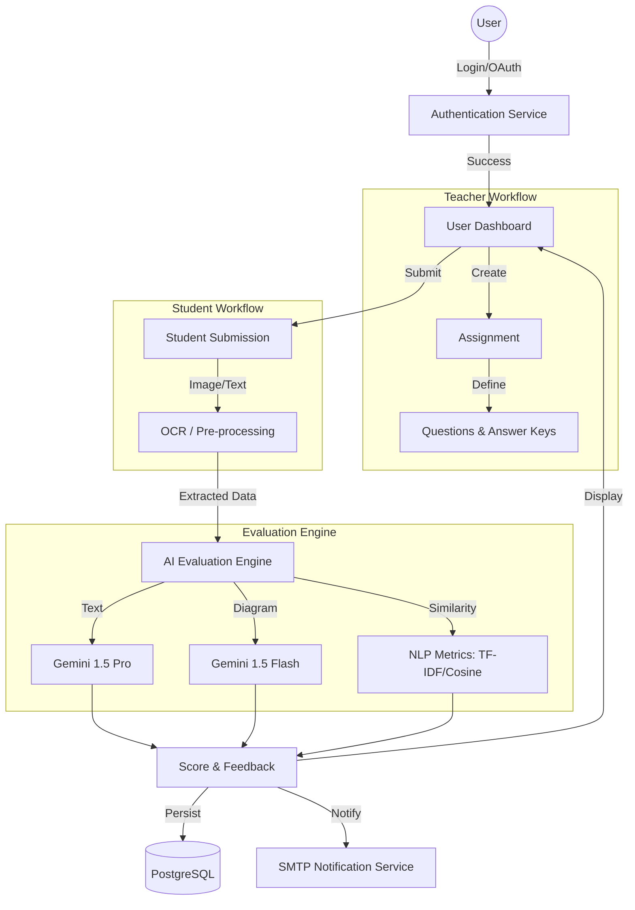

# EduEval: Advanced AI-Powered Automated Grading System

### Primary Developer and Visionary
**Suyash Vishwas Jadhav**
- Project Architect & Lead Developer
- Idea Creator & Full Stack Engineer
- System Integrator & Lead Tester

### Core Contributors
- **HARSH GAWANDE**: Developed Multimodal Diagram Evaluation System
- **VEDANT GOSAVI**: Structured Google Authentication and Authorization Infrastructure

---

## Navigation
- [Problem Statement](#problem-statement)
- [System Diagram](#system-diagram)
- [Project Overview](#project-overview)
- [Key Features](#key-features)
- [Core Modules & File Architecture](#core-modules--file-architecture)
- [Technical Architecture](#technical-architecture)
- [Evaluation Workflow](#evaluation-workflow)
- [Installation and Setup](#installation-and-setup)
- [Future Scope](#future-scope)
- [Security and Attribution](#security-and-attribution)
- [License](#license)

---

## Problem Statement
Traditional educational assessment methods are increasingly becoming a bottleneck in modern pedagogical workflows. The manual evaluation of student submissions presents several critical challenges:
1. **Scalability**: Evaluating hundreds of subjective answers and complex diagrams is labor-intensive and slow.
2. **Subjectivity**: Human grading can be inconsistent, influenced by fatigue or individual bias.
3. **Delayed Feedback**: Students often receive feedback weeks after submission, reducing the impact of the learning correction phase.
4. **Complexity in Diagrams**: Assessing the accuracy of flowcharts, circuit diagrams, and logical schemas requires specialized attention that is rarely automated effectively.
5. **Academic Integrity**: Detecting nuanced plagiarism in textual and visual submissions is difficult with standard tools.

---

## System Diagram

---

## Project Overview
EduEval is a state-of-the-art automated grading platform designed to bridge the gap between high-volume assessments and qualitative feedback. By leveraging industrial-grade Artificial Intelligence (Google Gemini 1.5 Pro and Flash), EduEval provides a comprehensive environment for teachers and students to manage assignments with near-instantaneous, high-fidelity evaluation.

The system is not just a grader; it is a pedagogical assistant that understands context, grammar, and even visual logic, ensuring that the feedback provided to students is constructive and data-driven.

---

## Key Features

### 1. Multimodal AI Evaluation
- **Text Analysis**: Utilizes Google Gemini 1.5 Pro to evaluate answers based on relevance, factual accuracy, and completeness.
- **Diagram Assessment**: Advanced comparison of student-submitted diagrams against answer keys using Gemini 1.5 Flash.
- **OCR Integration**: Built-in Optical Character Recognition (macOS Vision Framework) to convert handwritten or scanned images into editable text.

### 2. Intelligent Scoring Metrics
- **NLP Similarity**: Implements Cosine Similarity and Jaccard Indexing via TF-IDF vectorization to assess how closely a student's answer aligns with the expected key.
- **Grammar & Syntax**: Dedicated AI-driven grammar checking to provide linguistic feedback.
- **Dynamic Marking**: Automatic marks calculation based on AI-derived confidence and relevance scores.

### 3. Comprehensive User Management
- **Role-Based Access Control (RBAC)**: Distinct dashboards for Admins (Teachers) and Students.
- **Organizational Structure**: Supports hierarchical management where users are grouped by educational institutions or departments.
- **Secure Authentication**: Integrated Google OAuth 2.0 and standard email/password authentication (salted and hashed).

---

## Core Modules & File Architecture

### Backend Core
- **`app.py`**: The central nervous system of EduEval. It initializes the Flask application, handles core routing, integrates SMTP for secure email notifications, and houses the primary AI evaluation logic for textual submissions.
- **`models.py`**: Defines the relational database schema using SQLAlchemy. It manages complex relationships between Users, Organizations, Teachers, Assignments, Questions, Submissions, and Chat Messages.
- **`extensions.py`**: A clean implementation of the Singleton pattern for Flask extensions, ensuring the Database instance (SQLAlchemy) is shared correctly across modules without circular imports.

### Authentication & Authorization (Developed by VEDANT GOSAVI)
- **`google_oauth_app.py`**: A specialized module that bridges EduEval with Google Cloud Platform. It implements the OAuth 2.0 flow, managing discovery URLs, token requests, and user profile synchronization for professional-grade single sign-on (SSO) capabilities.

### Diagram Analysis Engine (Developed by HARSH GAWANDE)
- **`diagram_analyzer.py`**: The heavy-lifting engine for visual evaluation. It utilizes Google Gemini 1.5 Flash to encode images into base64 and perform structural comparisons between answer keys and student submissions.
- **`diagram_routes.py`**: Dedicated API endpoints for the diagram evaluation subsystem. It handles secure file uploads, temporary file positioning, and interacts with the `DiagramAnalyzer` to return real-time metrics.

### Utility & Entry Points
- **`main.py`**: The standardized entry point for application execution, ensuring environment variables and configuration are properly loaded before server boot.
- **`uploads/`**: A secure directory for persisting student submissions and images during the evaluation process.

### Frontend Components
- **`templates/`**: Contains the Jinja2 HTML5 semantic templates for the Admin/Student dashboards, login interfaces, and evaluation reports.
- **`static/`**: Houses the system's design assets, including CSS3 stylesheets for modern UI aesthetics and client-side JavaScript for asynchronous (AJAX) communication with the backend.

---

## Technical Architecture

### Backend Stack
- **Framework**: Python Flask
- **Database**: PostgreSQL (Relational Data Persistence)
- **ORM**: SQLAlchemy
- **Authentication**: Google OAuth 2.0 / Werkzeug Security
- **Email Service**: SMTP (Gmail Integration)

### AI and Data Science Suite
- **Generative AI**: Google Generative AI (Gemini SDK)
- **OCR Engine**: Apple Vision / Quartz / Cocoa (Optimized for macOS)
- **Natural Language Processing**: SpaCy, Scikit-Learn (TF-IDF, Metrics)
- **Computation**: NumPy

---

## Evaluation Workflow

1. **Submission**: The student uploads a text response or an image of their handwritten work/diagram.
2. **Pre-processing**: 
   - If an image is uploaded, the OCR engine extracts the text.
   - Text is cleaned and lemmatized using SpaCy.
3. **AI Assessment**:
   - The system sends the prompt and the student's text to Gemini 1.5 Pro.
   - For diagrams, Gemini 1.5 Flash compares the visual structure.
4. **Scoring**: 
   - A Relevance Score (0-100) is generated.
   - Plagiarism checks are run against the answer key.
5. **Storage & Feedback**: Results are persisted in the PostgreSQL database.

---

## Installation and Setup

### Prerequisites
- Python 3.12+
- PostgreSQL
- macOS (for native OCR support) or compatible environment
- Google Gemini API Key
- Google OAuth Credentials

---

## Future Scope
1. **Cross-Platform OCR**: Implementing Tesseract OCR to support Windows/Linux environments.
2. **LMS Integration**: API hooks for Canvas, Moodle, and Google Classroom.
3. **Advanced Plagiarism Detection**: Integration with internal cross-student plagiarism checks.
4. **Mobile Application**: Flutter or React Native app for students to scan and upload work directly.

---

## Security and Attribution
- **Code Ownership**: All source code is protected by copyright headers.
- **Data Privacy**: No student data is shared with third parties except for anonymized prompts sent to Google Gemini for evaluation.
- **Repository Integrity**: This repository serves as the single source of truth for the project's commit history and authorship.

---

## License
This project is licensed under the **MIT License**.
See the [LICENSE](LICENSE) file for details.

Copyright (c) 2024-2025 Suyash Vishwas Jadhav. All rights reserved.
